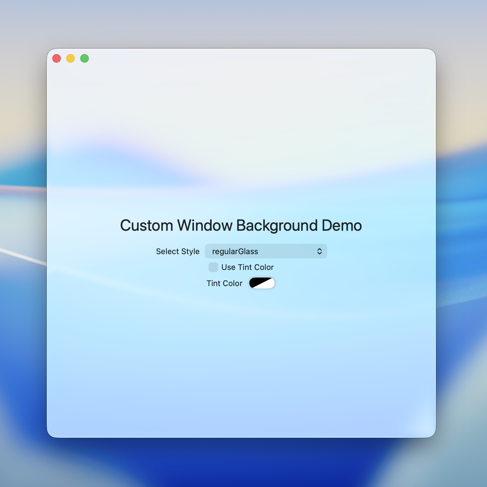

# Custom Window Background Demo

A showcase of different window background styles and visual effects available in macOS using `NSVisualEffectView` and `NSGlassEffectView`. Features dynamic switching between different background materials with optional tint colors.

No private APIs are used.

To test these out, clone this repo and open in Xcode, then run the project. You can switch between different background styles using the dropdown menu in the app.

Most of the code is in `BackgroundViewController.swift`.

## Liquid Glass Effects

Liquid Glass is introduced in macOS 26, which is available through `NSGlassEffectView`.

### Regular Glass

A regular glass effect that provides a frosted glass effect with a slight background blur and distortion on the edges.

<p align="center">
  
</p>

```swift
let view = NSGlassEffectView()
view.cornerRadius = 16
view.style = .regular
```

### Clear Glass

A clear variant of the glass effect that provides a transparent background without any blur.

<p align="center">
  
</p>

```swift
let view = NSGlassEffectView()
view.cornerRadius = 16
view.style = .clear
```

### Glass with Tint Color

Glass effect with custom tint color applied.

<p align="center">
  
</p>

```swift
let view = NSGlassEffectView()
view.cornerRadius = 16
view.style = .regular
view.tintColor = NSColor(tintColor)
```

## Other Background Styles

These styles use `NSVisualEffectView` with different materials and blending modes to create various background effects.

### HUD Window

<p align="center">
  
</p>

```swift
let view = NSVisualEffectView()
view.material = .hudWindow
view.blendingMode = .behindWindow
view.state = .active
```

### Popover

```swift
let view = NSVisualEffectView()
view.material = .popover
view.blendingMode = .behindWindow
view.state = .active
```

### Menu

```swift
let view = NSVisualEffectView()
view.material = .menu
view.blendingMode = .behindWindow
view.state = .active
```

### Under Window Background

```swift
let view = NSVisualEffectView()
view.material = .underWindowBackground
view.blendingMode = .behindWindow
view.state = .active
```

### Titlebar

```swift
let view = NSVisualEffectView()
view.material = .titlebar
view.blendingMode = .behindWindow
view.state = .active
```

## Requirements

- macOS 26.0
- Xcode 26.0 Beta 5
